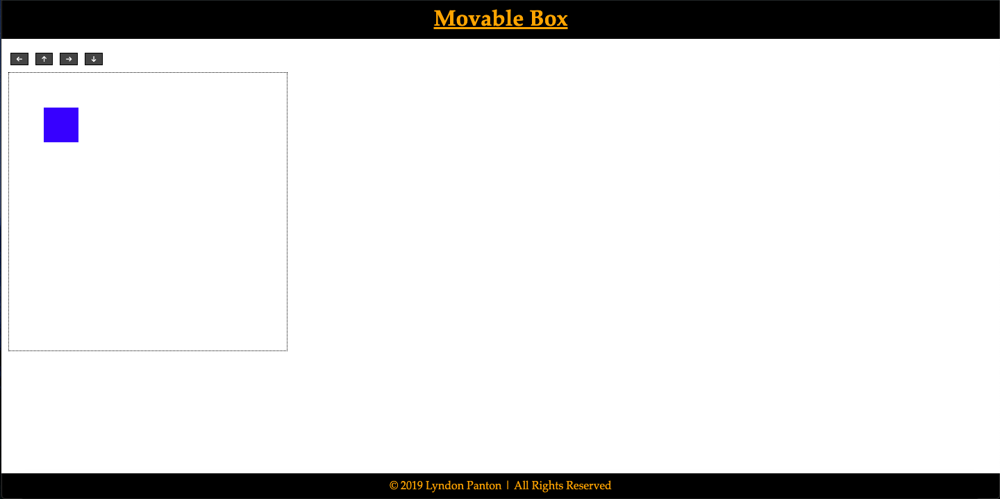
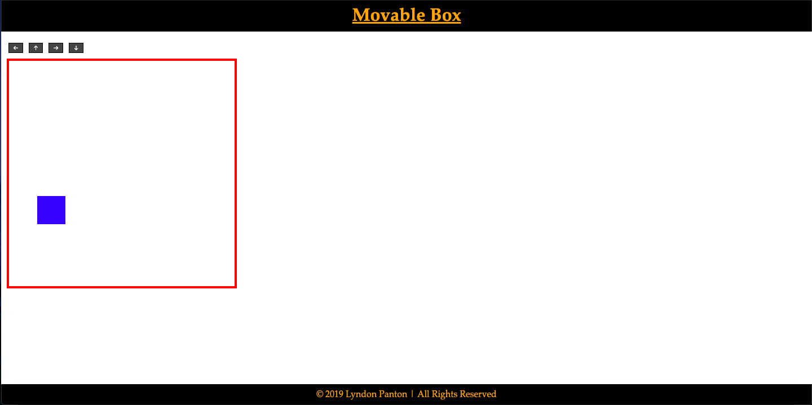
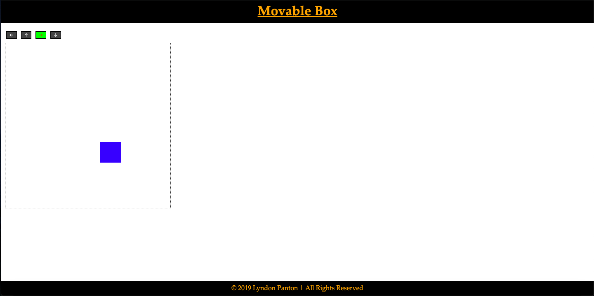

# Movable Box

## How To Open
> 1. Go to the project's download folder
> 2. Right click on the file named _index.html_
> 3. Choose the _open with_ option
> 4. Open the project in your desired browser

## How To Use
> 1. Click the arrow buttons to move the box in the area
> 2. Focus on the area by clicking on/tabbing to it and use your keyboards arrow or w, a, s or d keys to move the box in the area

## Requirements
> 1. This project requires a browser to run
> 2. The browser must have JavaScript available and enabled

## Extra Info
- N/A

## Preview

